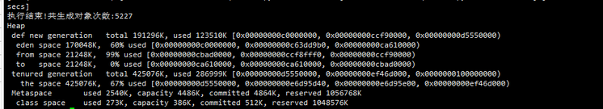

# week2
## 1、使用GCLogAnalysis.java 自己演练一遍串行/并行/CMS/G1的案例

> 对于不同 GC 的总结 - 测试类 GCLogAnalysis -Xms512m（初始堆） -Xmx512m（最大堆）
- Serial
    - fullGC发生时不会直接清空年轻代，年轻代继续使用自己的算法(DefNew->串行收集器)进行处理
    - GC执行时长  最大 0.04 secs  最小0.002 secs
        - 由于单线程的原因 GC 执行效率不高
- Parallel
    - Full GC 会清空年轻代的对象
    `2020-10-27T15:44:19.302+0800: [Full GC (Ergonomics) [PSYoungGen: 17300K->0K(116736K)] [ParOldGen: 329446K->241008K(349696K)] 346746K->241008K(466432K), [Metaspace: 2692K->2692K(1056768K)], 0.0322383 secs] [Times: user=0.28 sys=0.00, real=0.03 secs]
`
    - GC持续时长   最大 0.04 secs  最小0.002 secs

- CMS
  - youngGC 由于CMS抢线程所以出现执行时长有时候会变长
 ```java
- CMSGC发生时不会影响其他线程，youngGC照常工作
2020-10-27T19:00:09.112+0800: [GC (Allocation Failure) 2020-10-27T19:00:09.112+0800: [ParNew: 157246K->17470K(157248K), 0.0254942 secs] 267443K->171815K(506816K), 0.0258422 secs] [Times: user=0.16 sys=0.00, real=0.03 secs]
2020-10-27T19:00:09.160+0800: [GC (Allocation Failure) 2020-10-27T19:00:09.161+0800: [ParNew: 157228K->17470K(157248K), 0.0266121 secs] 311572K->219557K(506816K), 0.0269011 secs] [Times: user=0.13 sys=0.02, real=0.03 secs]
2020-10-27T19:00:09.188+0800: [GC (CMS Initial Mark) [1 CMS-initial-mark: 202086K(349568K)] 222475K(506816K), 0.0007942 secs] [Times: user=0.00 sys=0.00, real=0.00 secs]
2020-10-27T19:00:09.189+0800: [CMS-concurrent-mark-start]
2020-10-27T19:00:09.191+0800: [CMS-concurrent-mark: 0.002/0.002 secs] [Times: user=0.00 sys=0.00, real=0.00 secs]
2020-10-27T19:00:09.192+0800: [CMS-concurrent-preclean-start]
2020-10-27T19:00:09.192+0800: [CMS-concurrent-preclean: 0.000/0.000 secs] [Times: user=0.00 sys=0.00, real=0.00 secs]
2020-10-27T19:00:09.193+0800: [CMS-concurrent-abortable-preclean-start]
2020-10-27T19:00:09.212+0800: [GC (Allocation Failure) 2020-10-27T19:00:09.212+0800: [ParNew: 157246K->17471K(157248K), 0.0257702 secs] 359333K->267231K(506816K), 0.0260880 secs] [Times: user=0.28 sys=0.00, real=0.03 secs]
2020-10-27T19:00:09.257+0800: [GC (Allocation Failure) 2020-10-27T19:00:09.257+0800: [ParNew: 157247K->17471K(157248K), 0.0260615 secs] 407007K->313813K(506816K), 0.0263410 secs] [Times: user=0.19 sys=0.01, real=0.03 secs]
2020-10-27T19:00:09.305+0800: [GC (Allocation Failure) 2020-10-27T19:00:09.305+0800: [ParNew: 157247K->17468K(157248K), 0.0243856 secs] 453589K->356919K(506816K), 0.0247650 secs] [Times: user=0.27 sys=0.02, real=0.02 secs]
2020-10-27T19:00:09.330+0800: [CMS-concurrent-abortable-preclean: 0.003/0.137 secs] [Times: user=0.78 sys=0.03, real=0.14 secs]
2020-10-27T19:00:09.330+0800: [GC (CMS Final Remark) [YG occupancy: 20380 K (157248 K)]2020-10-27T19:00:09.331+0800: [Rescan (parallel) , 0.0006420 secs]2020-10-27T19:00:09.331+0800: [weak refs processing, 0.0002155 secs]2020-10-27T19:00:09.332+0800: [class unloading, 0.0004018 secs]2020-10-27T19:00:09.332+0800: [scrub symbol table, 0.0004259 secs]2020-10-27T19:00:09.333+0800: [scrub string table, 0.0002080 secs][1 CMS-remark: 339450K(349568K)] 359831K(506816K), 0.0024723 secs] [Times: user=0.00 sys=0.00, real=0.00 secs]
2020-10-27T19:00:09.333+0800: [CMS-concurrent-sweep-start]
2020-10-27T19:00:09.334+0800: [CMS-concurrent-sweep: 0.001/0.001 secs] [Times: user=0.00 sys=0.00, real=0.00 secs]
2020-10-27T19:00:09.334+0800: [CMS-concurrent-reset-start]
2020-10-27T19:00:09.335+0800: [CMS-concurrent-reset: 0.001/0.001 secs] [Times: user=0.00 sys=0.00, real=0.00 secs]
2020-10-27T19:00:09.355+0800: [GC (Allocation Failure) 2020-10-27T19:00:09.355+0800: [ParNew: 157244K->157244K(157248K), 0.0001433 secs]2020-10-27T19:00:09.355+0800: [CMS: 304466K->264086K(349568K), 0.0412080 secs] 461711K->264086K(506816K), [Metaspace: 2692K->2692K(1056768K)], 0.0420383 secs] [Times: user=0.05 sys=0.00, real=0.04 secs]

- 这里的 GC时间过长 可能就是因为抢线程造成的
2020-10-27T19:00:09.918+0800: [GC (Allocation Failure) 2020-10-27T19:00:09.918+0800: [ParNew: 139776K->139776K(157248K), 0.0003704 secs]2020-10-27T19:00:09.919+0800: [CMS: 343302K->347481K(349568K), 0.0573220 secs] 483078K->347481K(506816K), [Metaspace: 2692K->2692K(1056768K)], 0.0583604 secs] [Times: user=0.06 sys=0.00, real=0.06 secs]
    - CMS设置内存不能太小，太小了没法干活，也不能太大，太大了影响youngGC，会跟他抢线程
```
  

- G1
    - 没有老年代年轻代的区分
    - 低停顿
    - 日志有点复杂 - 但是大小显示单位为MB这个好
    
    
- 总结
    - 堆内存调整越大 GC执行时间越长
    - Serial 单线程 执行效率低，对比其他三个他的执行时间是最长的
    - CMS full minor 一起跑,效率可以但是 CMS的线程数设置太多会影响young的 
    - <font face="微软雅黑" color=#00ffff >在linux中 出现了 堆内存大的比小的生成的对象少？？</font> 
        - linuxjdk 
        - 1g    
        - 2g  linux:执行结束!共生成对象次数:5191 (没截图) 
        - 4g  是正常增长的 5533

------------------------------------------------------
## 2、使用压测工具（wrk或sb），演练gateway-server-0.0.1-SNAPSHOT.jar 示例 (windows 测试)
> sb -u http://localhost:8088/api/hello -c 20 -N 60 

>java -XX:+UseSerialGC -Xms512m -Xmx512m  -jar .\gateway-server-0.0.1-SNAPSHOT.jar
>java -XX:+UseParallelGC -Xms512m -Xmx512m  -jar .\gateway-server-0.0.1-SNAPSHOT.jar
>java -XX:+UseConcMarkSweepGC -Xms512m -Xmx512m  -jar .\gateway-server-0.0.1-SNAPSHOT.jar
>java -XX:+UseG1GC -Xms512m -Xmx512m  -jar .\gateway-server-0.0.1-SNAPSHOT.jar

|GC/内存|512|1024|
|---|---|---|
|Serial|RPS: 6 (requests/second)|RPS: 5.8 (requests/second)|
|Parallel|RPS: 5 (requests/second)|RPS: 5.8 (requests/second)|
|CMS|RPS: 5.9 (requests/second)|RPS: 5.3 (requests/second)|
|G1|RPS: 4.9 (requests/second)|RPS: 5.8 (requests/second)|
- 压力测试发现 只要没有出现一直FullGC或者直接OOM 吞吐量 跟 GC的选择和内存的设置 没有直接关系

------------------------------------------------------
## 4、（可选）运行课上的例子，以及Netty 的例子，分析相关现象
压力测试： sb -u http://localhost:8801(~3/<8/test>) -c 40 -N 30
- 1.单线程：                RPS: 46.8 (requests/second)
- 2.多线程：                RPS: 631.9 (requests/second)
- 3.有线程池的多线程：        RPS: 716.9 (requests/second)
- 4.netty                  RPS: 4803.4 (requests/second)
> 从 1~4 的 吞吐量看出 性能有明显的提升！
> netty 压测后台疯狂 `java.io.IOException: 远程主机强迫关闭了一个现有的连接` 老师说这是系统在线程使用完后自动帮你关闭IO,可以忽略！

----------------------------------------------------

## 5、写一段代码，使用HttpClient 或OkHttp 访问http://localhost:8801，代码提交到Github。
```xml
        <dependency>
            <groupId>org.apache.httpcomponents</groupId>
            <artifactId>httpclient</artifactId>
        </dependency>
        <dependency>
            <groupId>com.alibaba</groupId>
            <artifactId>fastjson</artifactId>
            <version>1.2.72</version>
        </dependency>


        <dependency>
                <groupId>commons-logging</groupId>
                <artifactId>commons-logging</artifactId>
                <version>1.2</version>
        </dependency>
# 注意 如果项目是纯净版 那就很有可能没有日志依赖 httpClient 中需要手动引入日志依赖要不然会报如下错误：
Exception in thread "main" java.lang.NoClassDefFoundError: org/apache/commons/logging/LogFactory
	at org.apache.http.conn.ssl.DefaultHostnameVerifier.<init>(DefaultHostnameVerifier.java:82)
	at org.apache.http.impl.client.HttpClientBuilder.build(HttpClientBuilder.java:955)
	at org.apache.http.impl.client.HttpClients.createDefault(HttpClients.java:56)
	at HttpClient.main(HttpClient.java:21)
Caused by: java.lang.ClassNotFoundException: org.apache.commons.logging.LogFactory

```
```java
import org.apache.http.HttpEntity;
import org.apache.http.client.methods.CloseableHttpResponse;
import org.apache.http.client.methods.HttpGet;
import org.apache.http.impl.client.CloseableHttpClient;
import org.apache.http.impl.client.HttpClients;
import org.apache.http.util.EntityUtils;

import java.io.IOException;

/**
 * @author tn
 * @version 1
 * @ClassName HttpClient
 * @description 访问http
 * @date 2020/10/27 21:25
 */
public class HttpClient {


    public static void main(String[] args){
        CloseableHttpResponse resp = null;
        CloseableHttpClient httpClient = null;
        try {
            httpClient = HttpClients.createDefault();
            HttpGet httpGet = new HttpGet("http://localhost:8808/test");
            resp = httpClient.execute(httpGet);
            if(resp.getStatusLine().getStatusCode()==200){
                HttpEntity body = resp.getEntity();
                //使用工具类EntityUtils，从响应中取出实体表示的内容并转换成字符串
                String data = EntityUtils.toString(body, "utf-8");
                System.out.println(data);
            }
        }catch (Exception e){
            System.err.println("接口调用失败");
        }finally {
            //关闭资源
            try {
               if(null!=resp){
                   resp.close();
               }
            } catch (IOException e) {
                System.err.println("resp关闭失败");
            }
            try {
                if(null!=httpClient){
                    httpClient.close();
                }
            } catch (IOException e) {
                System.err.println("httpClient关闭失败");
            }
        }

    }

}


## 结果
"C:\Program Files\Java\jdk1.8.0_191\bin\java.exe" -Dvisualvm.id=436006840789800 "-javaagent:I:\IntelliJ IDEA\IntelliJ IDEA 2020.1.1\lib\idea_rt.jar=54963:I:\IntelliJ IDEA\IntelliJ IDEA 2020.1.1\bin" -Dfile.encoding=UTF-8 -classpath "C:\Program Files\Java\jdk1.8.0_191\jre\lib\charsets.jar;C:\Program Files\Java\jdk1.8.0_191\jre\lib\deploy.jar;C:\Program Files\Java\jdk1.8.0_191\jre\lib\ext\access-bridge-64.jar;C:\Program Files\Java\jdk1.8.0_191\jre\lib\ext\cldrdata.jar;C:\Program Files\Java\jdk1.8.0_191\jre\lib\ext\dnsns.jar;C:\Program Files\Java\jdk1.8.0_191\jre\lib\ext\jaccess.jar;C:\Program Files\Java\jdk1.8.0_191\jre\lib\ext\jfxrt.jar;C:\Program Files\Java\jdk1.8.0_191\jre\lib\ext\localedata.jar;C:\Program Files\Java\jdk1.8.0_191\jre\lib\ext\nashorn.jar;C:\Program Files\Java\jdk1.8.0_191\jre\lib\ext\sunec.jar;C:\Program Files\Java\jdk1.8.0_191\jre\lib\ext\sunjce_provider.jar;C:\Program Files\Java\jdk1.8.0_191\jre\lib\ext\sunmscapi.jar;C:\Program Files\Java\jdk1.8.0_191\jre\lib\ext\sunpkcs11.jar;C:\Program Files\Java\jdk1.8.0_191\jre\lib\ext\zipfs.jar;C:\Program Files\Java\jdk1.8.0_191\jre\lib\javaws.jar;C:\Program Files\Java\jdk1.8.0_191\jre\lib\jce.jar;C:\Program Files\Java\jdk1.8.0_191\jre\lib\jfr.jar;C:\Program Files\Java\jdk1.8.0_191\jre\lib\jfxswt.jar;C:\Program Files\Java\jdk1.8.0_191\jre\lib\jsse.jar;C:\Program Files\Java\jdk1.8.0_191\jre\lib\management-agent.jar;C:\Program Files\Java\jdk1.8.0_191\jre\lib\plugin.jar;C:\Program Files\Java\jdk1.8.0_191\jre\lib\resources.jar;C:\Program Files\Java\jdk1.8.0_191\jre\lib\rt.jar;F:\project\java\jike\JAVA-000\Week_02\target\classes;F:\maven-repository\org\apache\httpcomponents\httpclient\4.5.6\httpclient-4.5.6.jar;F:\maven-repository\org\apache\httpcomponents\httpcore\4.4.10\httpcore-4.4.10.jar;F:\maven-repository\commons-codec\commons-codec\1.11\commons-codec-1.11.jar;F:\maven-repository\commons-logging\commons-logging\1.2\commons-logging-1.2.jar;F:\maven-repository\com\alibaba\fastjson\1.2.72\fastjson-1.2.72.jar" HttpClient
hello,kimmking

进程已结束,退出代码0
```

------------------------------------------------------


